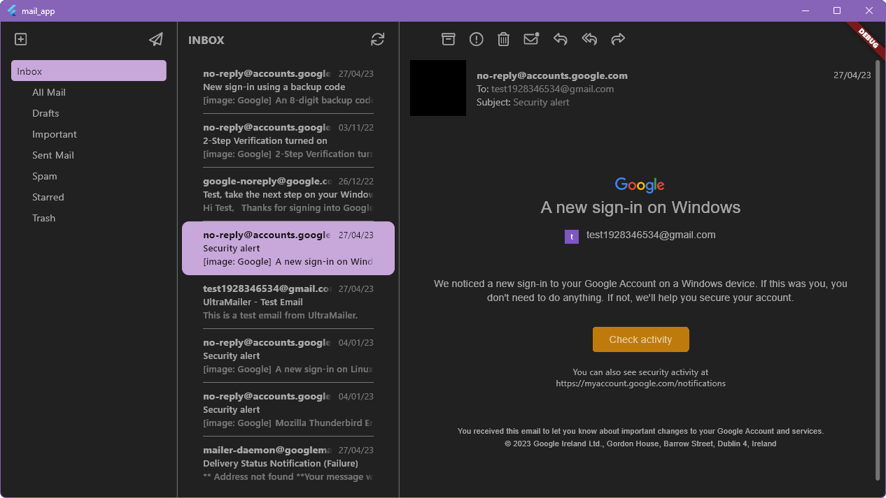
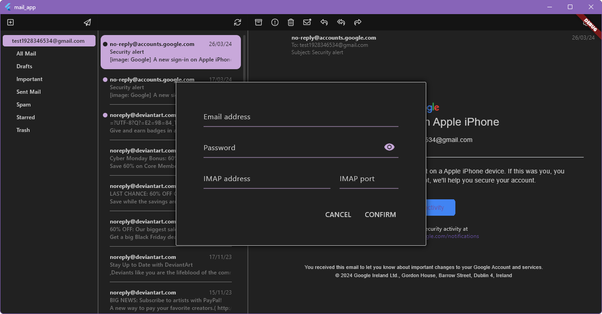

# mail_app (Simple Mail App/ Just Mails)

A new Flutter project for myself. Learning and creating a mail app for windows (maybe translate to iOS in the maybe far future) which has all the features I need, nothing more and nothing less.

I started it because the mail clients I used got updated and reworked, in my opinion for the worse. This wil be a simple replacement for viewing and sending email without any bullshit features I do not need like calenders, planners, or proprietary folders.

In general I want support for multiple email addresses, options for showing unread at the top of the inbox, a shared inbox which combines the inboxes of all emails addresses, customization of the color pallet, and OAuth support for logging in.

## Backend

The backend is written in Rust and uses a websocket to communicate with the frontend. It uses the imap crate to connect to the email servers. It stores a local cache of the emails in a sqlite database.

Run rust backend with ```cd backend && cargo run```

## Frontend

The frontend is written in Flutter and uses the web_socket_client package to communicate with the backend. The html emails are rendered with the flutter_widget_from_html package which converts html to flutter widgets.

Run flutter frontend with ```flutter run -d windows```

## Screenshots





## Database Design

| CONNECTIONS   |      |              |
|---------------|------|--------------|
| username      | PK   | VARCHAR(500) |
| password      |      | VARCHAR(500) |
| address       | PK   | VARCHAR(500) |
| port          |      | INT          |
| updated_at    |      | DATETIME     |

| MAILBOXES           |        |              |
|---------------------|--------|--------------|
| connection_username | FK, PK | INT          |
| connection_address  | FK, PK | INT          |
| path                | PK     | VARCHAR(500) |
| updated_at          |        | DATETIME     |

| MESSAGES            |        |              |
|---------------------|--------|--------------|
| message_uid         | PK     | INT          |
| connection_username | FK, PK | INT          |
| connection_address  | FK, PK | INT          |
| mailbox_path        | FK, PK | INT          |
| session_id          |        | INT          |
| message_id          |        | VARCHAR(500) |
| subject             |        | VARCHAR(500) |
| from                |        | VARCHAR(500) |
| sender              |        | VARCHAR(500) |
| to                  |        | VARCHAR(500) |
| cc                  |        | VARCHAR(500) |
| bcc                 |        | VARCHAR(500) |
| reply_to            |        | VARCHAR(500) |
| in_reply_to         |        | VARCHAR(500) |
| delivered_to        |        | VARCHAR(500) |
| date                |        | DATETIME     |
| received            |        | DATETIME     |
| html                |        | TEXT         |
| text                |        | TEXT         |
| updated_at          |        | DATETIME     |

## API spec

### LOGIN

login to an IMAP server and create a session.

/login

- `username` (string): The username of the user
- `password` (string): The password of the user
- `address` (string): The address of the user
- `port` (int): The port of the user

```jsonc
{
    "success": true,
    "message": "message",
    "data": {                         // session id of new session
      "session_id": 1
    }
}
```

### LOGOUT

Logout from the IMAP server and delete the session.

/logout

- `session_id` (int): The session id of the user

```jsonc
{
    "success": true,
    "message": "message"
}
```

### GET_SESSIONS

Get all the logged in IMAP sessions

/get_sessions

```jsonc
{
    "success": true,
    "message": "message",
    "data": [                         // list of connected sessions
      {
        "session_id": 1,
        "username": "username",
        "address": "address",
        "port": 1
      }
    ]
}
```

### GET_MAILBOXES

Get all the mailbox paths of a session.

/get_mailboxes

- `session_id` (int): The session id of the user

```jsonc
{
    "success": true,
    "message": "message",
    "data": [                         // list of mailbox paths
      "mailbox_path"
    ]
}
```

### GET_MESSAGES

Get a message from a mailbox using the message uids from the local database only.

/get_messages

- `session_id` (int): The session id of the user
- `mailbox_path` (string): The mailbox path
- `message_uids` (comma separated list): The uids of the messages

```jsonc
{
  "success": true,
  "message": "message",
  "data": [                           // list of messages
    {
      "uid": 1,
      "sequence_id": 1,
      "message_id": "server message id",
      "subject": "subject",
      "from": [
        {
          "name": "Google",
          "mailbox": "no-reply",
          "host": "accounts.google.com"
        }
      ],
      "sender": [],                   // same object as from
      "to": [],                       // same object as from
      "cc": [],                       // same object as from
      "bcc": [],                      // same object as from
      "reply_to": [],                 // same object as from
      "in_reply_to": "email string",
      "delivered_to": "email string",
      "date": 1722093349000,
      "received": 1722093350000,
      "flags": ["Seen", "Flagged"],
      "html": "base64 encoded html",
      "text": "base64 encoded text"
    }
  ]
}
```

### GET_MESSAGES_SORTED

get messages from a mailbox sorted on time with indexes\
calculated from the start and end indexes of the index numbers.\
Messages are retrieved from the local database only.

/get_messages_sorted

- `session_id` (int): The session id of the user
- `mailbox_path` (string): The mailbox path
- `start` (int): The start index of the messages
- `end` (int): The end index of the messages

```jsonc
{
  "success": true,
  "message": "message",
  "data": [                           // list of messages
    {
      "uid": 1,
      "sequence_id": 1,
      "message_id": "server message id",
      "subject": "subject",
      "from": [
        {
          "name": "Google",
          "mailbox": "no-reply",
          "host": "accounts.google.com"
        }
      ],
      "sender": [],                   // same object as from
      "to": [],                       // same object as from
      "cc": [],                       // same object as from
      "bcc": [],                      // same object as from
      "reply_to": [],                 // same object as from
      "in_reply_to": "email string",
      "delivered_to": "email string",
      "date": 1722093349000,
      "received": 1722093350000,
      "flags": ["Seen", "Flagged"],
      "html": "base64 encoded html",
      "text": "base64 encoded text"
    }
  ]
}
```

### UPDATE_MAILBOX

Update the mailbox of a session from the IMAP server.\

Algorithm:

1. select command to get exists (total number of messages)
2. fetch message with sequence id `exists` to get the uid
3. check if message in local database with sequence id `exists` has the same uid
4. if not, message is moved/deleted/added in the mailbox

    - fetch 'UID' for 10 at the time until sequence id and uid match
    - if message in local database update the sequence id and remove sequence id\
        from message in the same mailbox with the same sequence id
    - if message not in local database add message to local database

5. always, fetch with 'FLAGS' of all messages in the mailbox to update flags

/update_mailbox

- `session_id` (int): The session id of the user
- `mailbox_path` (string): The mailbox path

```jsonc
{
  "success": true,
  "message": "message",
  "data": [                           // list of changed messages
    {
      "uid": 1,
      "sequence_id": 1,
      "message_id": "server message id",
      "subject": "subject",
      "from": [
        {
          "name": "Google",
          "mailbox": "no-reply",
          "host": "accounts.google.com"
        }
      ],
      "sender": [],                   // same object as from
      "to": [],                       // same object as from
      "cc": [],                       // same object as from
      "bcc": [],                      // same object as from
      "reply_to": [],                 // same object as from
      "in_reply_to": "email string",
      "delivered_to": "email string",
      "date": 1722093349000,
      "received": 1722093350000,
      "flags": ["Seen", "Flagged"],
      "html": "base64 encoded html",
      "text": "base64 encoded text"
    }
  ]
}
```

### MODIFY_FLAGS

Modify the flags of a message in a mailbox using the message uid.

/modify_flags

- `session_id` (int): The session id of the user
- `mailbox_path` (string): The mailbox path
- `message_uid` (int): The uid of the message
- `flags` (comma separated list): The flags to modify (e.g. "Seen,Flagged,Deleted")
- `add` (bool): If the flags should be added or removed

```jsonc
{
  "success": true,
  "message": "message",
  "data": [                           // list of all flags
    "Seen",
    "Flagged"
  ]
}
```

### MOVE_MESSAGE

Move a message from one mailbox to another using the message uid.\
The message will be copied to the destination mailbox and deleted from\
the source mailbox using the IMAP move command.

/move_message

- `session_id` (int): The session id of the user
- `message_uid` (int): The uid of the message
- `mailbox_path_dest` (string): The destination mailbox path

```jsonc
{
  "success": true,
  "message": "message",
  "data": "mailbox_path_dest"         // destination mailbox path
}
```
