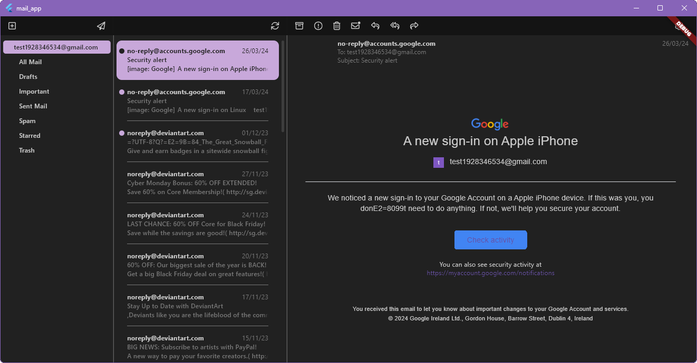

# mail_app (Simple Mail App/ Just Mails)

A new Flutter project for myself. Learning and creating a mail app for windows (maybe translate to iOS in the maybe far future) which has all the features I need, nothing more and nothing less.

I started it because the mail clients I used got updated and reworked, in my opinion for the worse. This wil be a simple replacement for viewing and sending email without any bullshit features I do not need like calenders, planners, or proprietary folders.

In general I want support for multiple email addresses, options for showing unread at the top of the inbox, a shared inbox which combines the inboxes of all emails addresses, customization of the color pallet, and OAuth support for logging in.

## Backend

The backend is written in Rust and uses a websocket to communicate with the frontend. It uses the imap crate to connect to the email servers. It stores a local cache of the emails in a sqlite database.

Run rust backend with ```cd backend && cargo run```

## Frontend

The frontend is written in Flutter and uses the web_socket_client package to communicate with the backend. The html emails are rendered with the flutter_widget_from_html package which converts html to flutter widgets.

Run flutter frontend with ```flutter run -d windows```

## Screenshots




## Database Design

| CONNECTIONS   |      |              |
|---------------|------|--------------|
| username      | PK   | VARCHAR(500) |
| password      |      | VARCHAR(500) |
| address       | PK   | VARCHAR(500) |
| port          |      | INT          |
| updated_at    |      | DATETIME     |

| MAILBOXES           |        |              |
|---------------------|--------|--------------|
| connection_username | FK, PK | INT          |
| connection_address  | FK, PK | INT          |
| path                | PK     | VARCHAR(500) |
| updated_at          |        | DATETIME     |

| MESSAGES            |        |              |
|---------------------|--------|--------------|
| message_uid         | PK     | INT          |
| connection_username | FK, PK | INT          |
| connection_address  | FK, PK | INT          |
| mailbox_path        | FK, PK | INT          |
| session_id          |        | INT          |
| message_id          |        | VARCHAR(500) |
| subject             |        | VARCHAR(500) |
| from                |        | VARCHAR(500) |
| sender              |        | VARCHAR(500) |
| to                  |        | VARCHAR(500) |
| cc                  |        | VARCHAR(500) |
| bcc                 |        | VARCHAR(500) |
| reply_to            |        | VARCHAR(500) |
| in_reply_to         |        | VARCHAR(500) |
| delivered_to        |        | VARCHAR(500) |
| date                |        | DATETIME     |
| received            |        | DATETIME     |
| html                |        | TEXT         |
| text                |        | TEXT         |
| updated_at          |        | DATETIME     |
